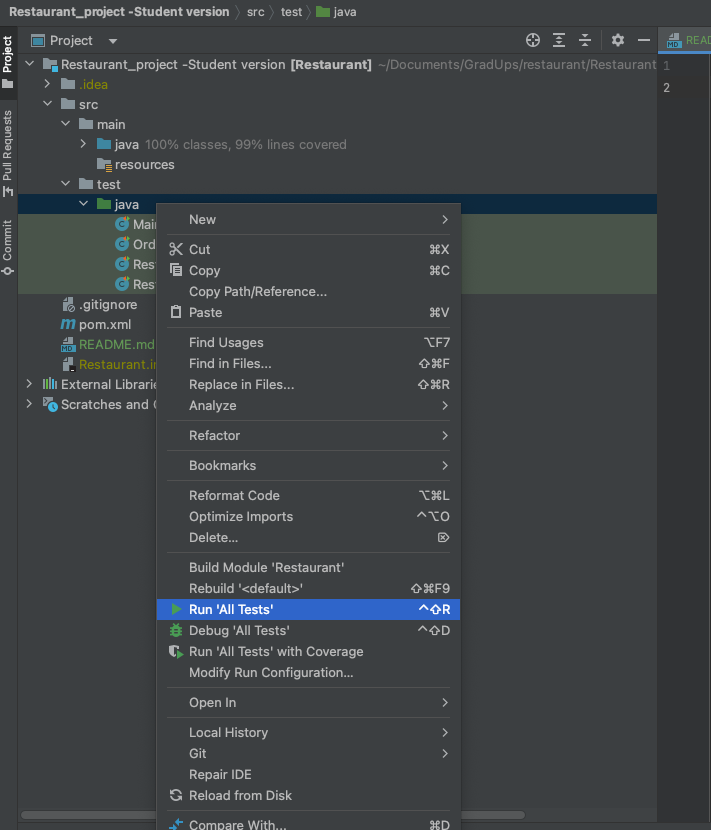

## Guideline run all test

I have written down some classes and methods which helped for running TDD easier.
### Class:
 
<b>OrderService</b> as the service helps add items and show total cost.
 
<b>itemExistedException</b> if item is added already, it will show that exception
 
<b>main</b> is running code by choice

### Test's classes:
<b>MainTest</b> which included scenario when running by main
 
<b>OrderServiceTest</b> test each case from happy-path to error-handling.